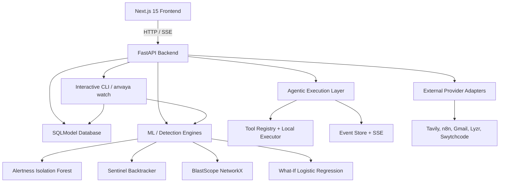
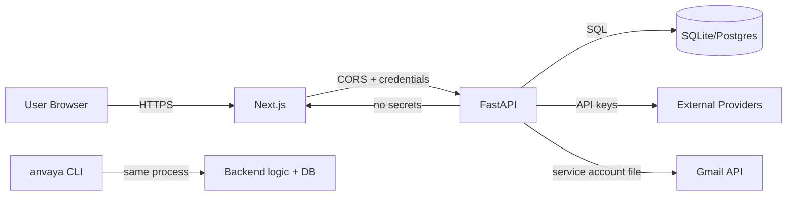
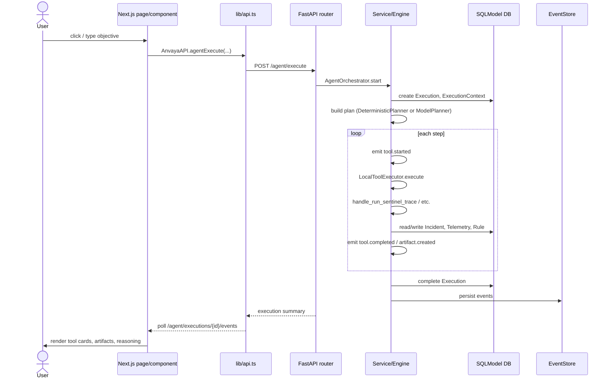

# ANVAYA — System Overview

> One-sentence: ANVAYA is an autonomous defensive cyber SOC simulator that ingests telemetry, detects anomalies, investigates incidents, proposes and validates detection rules, replays attacks, simulates blast radius and counterfactuals, and seals a hash-chained audit record.

## What ANVAYA is

ANVAYA is a full-stack application (Next.js 15 frontend + FastAPI backend + SQLModel/PostgreSQL or SQLite) that demonstrates the autonomous SOC lifecycle:

```text
miss → ground truth → backtrack → rule proposal → validation → identical replay → catch → blast simulation → what-if → sealed audit
```

It is defensive only: all attack scenarios are synthetic, deterministic, and isolated. It does not perform real-world offensive actions. It is designed to be judge-demo-ready, with a live execution trace visible in the frontend and truthful fallback when optional integrations are not configured.

## Major subsystems



| Subsystem | Purpose | Key Files |
|-----------|---------|-----------|
| **Frontend** | Dashboard, tiles, agent console, build UI, auth | `frontend/app/*`, `frontend/components/*`, `frontend/lib/*` |
| **Backend API** | FastAPI routes, request handling, session mgmt | `backend/anvaya/main.py`, `backend/anvaya/routers/*` |
| **Database / State** | SQLModel persistence, audit chain | `backend/anvaya/db.py`, `backend/anvaya/models/*` |
| **Agentic Layer** | Tool registry, executor, orchestrator, planner | `backend/anvaya/agent/*` |
| **ML / Detection** | Isolation Forest, Logistic Regression, feature extraction | `ml/anvaya/*`, `backend/anvaya/whatif`, `backend/anvaya/sentinel`, `backend/anvaya/blastscope` |
| **Live Scoring** | Real-time telemetry scoring and dispatch | `backend/anvaya/live/*`, `backend/anvaya/cli/watch.py` |
| **CLI / Control** | Interactive shell, Typer commands, watch | `backend/anvaya/cli/*` |
| **Integrations** | Tavily, n8n, Gmail, Lyzr, Swytchcode, LLM gateways | `backend/anvaya/agent/adapters.py`, `backend/anvaya/llm/*` |
| **Observability** | Structured logging, execution events, metrics | `backend/anvaya/logging.py`, `backend/anvaya/agent/events.py` |

## Runtime environments

- **Local dev:** Docker Compose with PostgreSQL 15, FastAPI on `8000`, Next.js on `3000`. SQLite can also be used (`sqlite:///./anvaya.db` in `.env`).
- **CLI mode:** `anvaya` starts an interactive prompt_toolkit shell; `anvaya serve` starts uvicorn.
- **Testing:** `pytest tests/` with SQLite in memory or on disk; mock external HTTP calls.
- **Production target:** Vercel frontend + Railway/Fly.io backend (config exists in `railway.toml`, `fly.toml`).

## Major data flows

1. **Live detection:** `POST /telemetry` or `anvaya watch` → `score_and_maybe_flag` → `AlertnessEngine.predict_single` → incident + audit → `on_incident_event` → optional Tavily/n8n/Signal.
2. **Investigation:** User objective → `AgentOrchestrator.start` → plan → `AgentLoop` → `LocalToolExecutor` → tools (`get_incident`, `run_sentinel_trace`, `run_blastscope`, etc.) → events → UI.
3. **Self-correction:** `SentinelEngine` → `backtrack` → `propose_rule` → `validate_rule` → `replay_attack` → status `CAUGHT` or `STILL_MISSED`.
4. **Project artifact build:** `POST /projects/{id}/build` or `manage_artifacts` → `ArtifactBuilder` → `ArtifactGenerator` → `ProjectArtifactPayload` + event stream.
5. **Audit chain:** Every state change writes an `AuditRecord` linked to the previous record hash; `verify_chain` detects tampering.

## Trust / security boundaries



- **Frontend never sees API keys.** `NEXT_PUBLIC_API_URL` is the only env var the frontend needs.
- **External credentials live in `.env`/`.env.local` and are loaded into `Settings`.**
- **LLM outputs are validated against schemas and never executed as code.**
- **The CLI runs in the same Python process as the backend logic, with the same DB credentials.**

## End-to-end request lifecycle



## Why the architecture exists this way

- **FastAPI + SQLModel** gives typed Python APIs with a single object-relational model.
- **Next.js App Router + React Query** gives server-state polling and a modern React component model.
- **Tool registry + executor** decouples the agent's reasoning from the actual business logic, so external orchestrators (Lyzr, Swytchcode) can be swapped in without changing the UI or core engines.
- **Honest fallback pattern** lets the demo run with zero external credentials while still showing truthful provider status.
- **Hash-chained audit records** support the “sealed audit” product story and provide tamper evidence.
- **Staged artifact build events** let the frontend render progress incrementally without long-polling the entire result.

## Glossary

| Term | Meaning |
|------|---------|
| **Alertness** | Isolation Forest anomaly detection engine |
| **SentinelBacktracker** | Self-correction engine: backtrack → rule → validate → replay |
| **BlastScope** | NetworkX graph traversal for blast-radius impact |
| **What-If Watcher** | Logistic Regression counterfactual risk analysis |
| **ControlLedger** | Hash-chained `AuditRecord` system |
| **ARTIFACT_TYPES** | 11 project artifact types: incidents, arbor, impacts, reach, replay, ecosystem, arena, orbits, segments, trophy_wall, ledger |
| **Execution** | A single agentic run with a unique `execution_id` and event log |
| **ToolResult** | Typed result from a tool execution, including provider and fallback attribution |

## Active recall

- **Child:** Imagine a security guard watching cameras. When the guard sees something weird, they open a case file, look at evidence, figure out how the intruder moved, test a new alarm rule, and then file a signed report. ANVAYA is that guard, but it also shows you each step on a screen.
- **Technical:** ANVAYA is a FastAPI + Next.js autonomous SOC simulator that uses Isolation Forest, NetworkX, and Logistic Regression to detect, investigate, simulate, and audit synthetic incidents.
- **Source:** <ref_file file="/home/de3p/Documents/Next.js/Anavaya/backend/anvaya/main.py" />, <ref_file file="/home/de3p/Documents/Next.js/Anavaya/frontend/lib/api.ts" />, <ref_file file="/home/de3p/Documents/Next.js/Anavaya/backend/anvaya/live/__init__.py" />, <ref_file file="/home/de3p/Documents/Next.js/Anavaya/backend/anvaya/agent/orchestrator.py" />.
- **Why it exists:** To make the SOC lifecycle judge-observable and reproducible with deterministic synthetic data and truthful provider fallbacks.
- **Common confusion:** ANVAYA is not a real SIEM; it is a defensive simulator. It does not attack live systems.
- **Recall question:** What are the five major subsystems and what is the single entry point for live anomaly detection?
- **Transfer question:** If we replaced the frontend with a different framework, which file(s) would definitely need to change?

## Source truth

- `backend/anvaya/main.py` — FastAPI app + router mounts.
- `backend/anvaya/config.py` — settings and feature toggles.
- `backend/anvaya/live/__init__.py` — `score_and_maybe_flag`.
- `backend/anvaya/agent/orchestrator.py` — agent start/run.
- `frontend/lib/api.ts` — frontend API client.
- `frontend/package.json` + `pyproject.toml` — stack inventory.
- `docker-compose.yml` — runtime topology.
