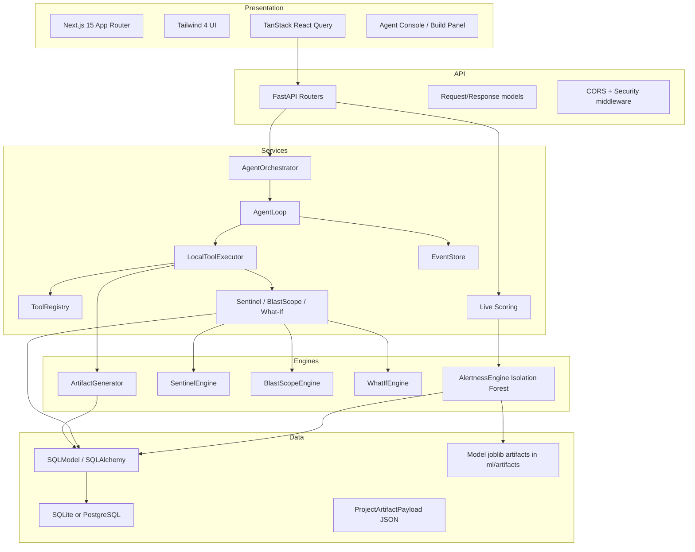

# ANVAYA — Architecture

## Layered architecture



## Component diagram

```mermaid
graph TB
    subgraph Frontend
        ROOT[/]
        S[/sentinel]
        P[/pathfinder]
        R[/responder]
        A[/auditor]
        DASH[/dashboard]
        PROJ[/projects/:id]
        SET[/settings]
        AGENT[AgentConsole]
        TILES[TileGrid]
    end

    subgraph Backend
        API[FastAPI /api/v1]
        INC[incidents router]
        TEL[telemetry router]
        DET[detections router]
        RUL[rules router]
        SEN[sentinel router]
        BLA[blastscope router]
        WHA[whatif router]
        AUD[audit router]
        GRA[graph router]
        MET[metrics router]
        PRO[projects router]
        DAT[datasets router]
        AGT[agent router]
        DEM[demo router]
        SIM[simulation router]
    end

    subgraph Engines
        AE[AlertnessEngine]
        SE[SentinelEngine]
        BSE[BlastScopeEngine]
        WIE[WhatIfEngine]
        ORC[AgentOrchestrator]
        EXE[LocalToolExecutor]
        REG[ToolRegistry]
        EVT[EventStore]
    end

    subgraph External
        TAV[Tavily]
        N8N[n8n]
        GMAIL[Gmail API]
        LYZR[Lyzr]
        LLM[OpenAI/NVIDIA/OpenRouter/etc.]
    end

    ROOT --> S
    S --> TILES
    AGENT --> API
    TILES --> API
    API --> INC & TEL & DET & RUL & SEN & BLA & WHA & AUD & GRA & MET & PRO & DAT & AGT & DEM & SIM
    TEL --> AE
    SEN --> SE
    BLA --> BSE
    WHA --> WIE
    AGT --> ORC
    ORC --> EXE
    EXE --> REG
    EXE --> SE & BSE & WIE
    ORC --> EVT
    EXE --> TAV & N8N & GMAIL & LYZR
    ORC --> LLM
```

## Subsystem responsibilities

### Frontend (Next.js 15)

- **App Router pages** render workspace views (`/sentinel`, `/pathfinder`, `/responder`, `/auditor`, `/dashboard`, `/projects/:id`).
- **Tile grid** (`react-grid-layout`) provides draggable dashboard panels per workspace.
- **Agent console** runs agentic objectives and chat; consumes SSE and React Query.
- **API layer** (`lib/api.ts`) centralizes all backend calls and hooks.
- **Auth** uses `better-auth` with email/password and organization plugins.

### Backend (FastAPI)

- **Routers** expose REST endpoints grouped by domain.
- **Dependency injection** uses `Depends(get_session)` for database sessions.
- **Auth dependency** (`get_auth_context`) is used only in `projects.py` today.
- **CORS + security headers** are configured in `main.py`.

### Agentic layer

- **ToolRegistry** holds ~40 `ToolDefinition`s with parameters, risk levels, providers, and fallbacks.
- **LocalToolExecutor** implements `handle_<tool>` methods that wrap real engines.
- **AgentOrchestrator** creates an `Execution`, selects a planner, and runs `AgentLoop`.
- **AgentLoop** emits `agent.*`, `tool.*`, `artifact.*`, and `incident.updated` events while stepping through a plan.
- **EventStore** persists `ExecutionEvent` rows and serves SSE/polling endpoints.

### ML / Detection engines

- **AlertnessEngine** (`ml/anvaya/alertness/__init__.py`) trains and scores with Isolation Forest.
- **WhatIfEngine** (`backend/anvaya/whatif/__init__.py`) trains and scores with Logistic Regression for counterfactuals.
- **SentinelEngine** (`backend/anvaya/sentinel/__init__.py`) backtracks evidence, proposes rules, validates, replays.
- **BlastScopeEngine** (`backend/anvaya/blastscope/__init__.py`) uses NetworkX to compute blast radius from asset graph.
- **ArtifactGenerator** (`backend/anvaya/generation.py`) builds a `WorldModel` and creates project artifacts.

### Data / persistence

- **SQLModel** domain models in `backend/anvaya/models/`.
- **AuditRecord** with SHA-256 hash chain.
- **ProjectArtifact + ProjectArtifactPayload** store generated artifact data.
- **ModelVersion** tracks trained model artifacts and metrics.

### Integrations

- **Adapters** in `backend/anvaya/agent/adapters.py` follow the provider-neutral pattern with honest fallback.
- **Live dispatch** in `backend/anvaya/live/dispatch.py` is the single integration hook point.
- **LLM providers** in `backend/anvaya/llm/providers.py` and catalog files.

## Key decisions and why

| Decision | Why |
|----------|-----|
| FastAPI + SQLModel | Typed Python, easy Pydantic integration, async-capable where needed. |
| Next.js 15 App Router | Modern React, server/client boundary control, route-based layouts. |
| Tool registry + executor | Decouple agent reasoning from business logic; support external orchestrators. |
| Provider adapters with fallback | Demo works without credentials; UI shows truthful status. |
| Hash-chained audit records | Tamper evidence and compliance story. |
| Staged build event stream | Incremental UI rendering of long artifact builds. |
| Deterministic synthetic data | Reproducible training, validation, and replay. |

## Source references

- <ref_file file="/home/de3p/Documents/Next.js/Anavaya/backend/anvaya/main.py" />
- <ref_file file="/home/de3p/Documents/Next.js/Anavaya/backend/anvaya/agent/registry.py" />
- <ref_file file="/home/de3p/Documents/Next.js/Anavaya/backend/anvaya/agent/executor.py" />
- <ref_file file="/home/de3p/Documents/Next.js/Anavaya/backend/anvaya/agent/orchestrator.py" />
- <ref_file file="/home/de3p/Documents/Next.js/Anavaya/ml/anvaya/alertness/__init__.py" />
- <ref_file file="/home/de3p/Documents/Next.js/Anavaya/backend/anvaya/sentinel/__init__.py" />
- <ref_file file="/home/de3p/Documents/Next.js/Anavaya/backend/anvaya/blastscope/__init__.py" />
- <ref_file file="/home/de3p/Documents/Next.js/Anavaya/backend/anvaya/whatif/__init__.py" />
- <ref_file file="/home/de3p/Documents/Next.js/Anavaya/backend/anvaya/models/__init__.py" />
