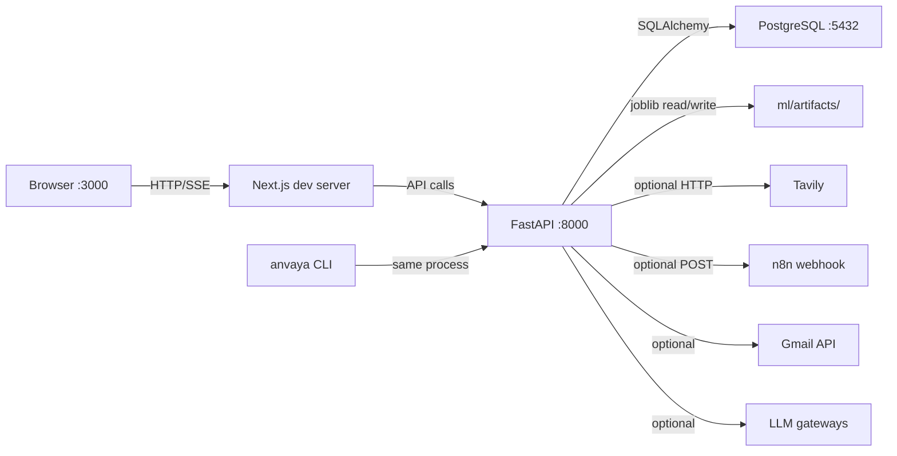
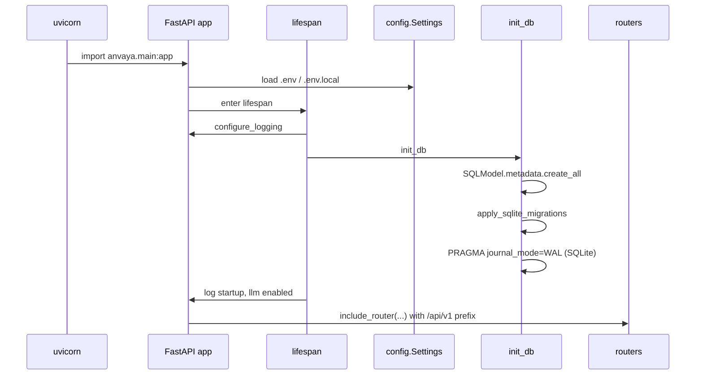

# ANVAYA — Runtime Topology

## Local development stack



## Docker Compose services

From `docker-compose.yml`:

| Service | Image / Build | Port | Depends on | Volumes |
|---------|---------------|------|------------|---------|
| `db` | `postgres:15-alpine` | `5432:5432` | — | `pgdata` |
| `backend` | `Dockerfile.backend` | `8000:8000` | `db` healthy | `backend`, `ml`, `simulator`, `datasets` |
| `frontend` | `Dockerfile.frontend` | `3000:3000` | `backend` | — |

Healthcheck on `db`: `pg_isready -U anvaya` every 5s.

## Backend startup flow



## Key ports and URLs

| Process | Default port | Config key | Notes |
|---------|--------------|------------|-------|
| Next.js dev | 3000 | — | `npm run dev` in `frontend/` |
| FastAPI | 8000 | `API_PORT` | `uvicorn anvaya.main:app` |
| PostgreSQL | 5432 | `DATABASE_URL` | `postgres:15-alpine` in compose |
| API base | `http://localhost:8000/api/v1` | `NEXT_PUBLIC_API_URL` | consumed by frontend |

## CLI entry points

| Command | Handler | Description |
|---------|---------|-------------|
| `anvaya` (no args) | `main.run_interactive_shell` | Interactive prompt_toolkit shell |
| `anvaya demo` | `typer_app.demo` | Run demo orchestrator |
| `anvaya data` | `typer_app.data` | Generate/load dataset |
| `anvaya train` | `typer_app.train` | Train Alertness + What-If + Sentinel cycle |
| `anvaya evaluate` | `typer_app.evaluate` | Evaluate model on dataset |
| `anvaya world` | `typer_app.world` | Generate world manifest |
| `anvaya models` | `typer_app.models` | Model catalog ops |
| `anvaya watch` | `typer_app.watch` | Real-time log/synthetic watcher |
| `anvaya serve` | `typer_app.serve` | Start uvicorn |

## Processes and concurrency

- **FastAPI** is primarily synchronous Python; routers call synchronous SQLModel sessions.
- **Agent execution** can run in a background thread when `background=true` is passed to `POST /agent/execute`.
- **Artifact build** (`POST /projects/{id}/build`) starts a background thread `build_artifact`.
- **SSE streaming** for `/agent/executions/{id}/stream` uses FastAPI `StreamingResponse` with an async generator.
- **CLI `anvaya watch`** runs a single-process loop tailing a file or generating synthetic events; no separate worker.

## File system layout at runtime

```text
/home/de3p/Documents/Next.js/Anavaya
├── backend/anvaya          # Python package
├── ml/anvaya               # ML engines
├── simulator/anvaya        # Synthetic telemetry
├── datasets/               # CSV exports
├── ml/artifacts/           # Trained models (joblib)
├── frontend/               # Next.js app
├── .env / .env.local       # secrets
├── anvaya.db               # default SQLite (dev)
├── anvaya_auth.db          # Better Auth SQLite
├── pyproject.toml
├── docker-compose.yml
└── .anvaya/knowledge/      # this doc
```

## Environment loading

`backend/anvaya/config.py` uses `pydantic_settings` with:

```python
class Config:
    env_file = [str(_PROJECT_ROOT / ".env"), str(_PROJECT_ROOT / ".env.local")]
```

`.env` is committed; `.env.local` is for local secrets and overrides.

## Source references

- <ref_file file="/home/de3p/Documents/Next.js/Anavaya/docker-compose.yml" />
- <ref_file file="/home/de3p/Documents/Next.js/Anavaya/backend/anvaya/main.py" />
- <ref_file file="/home/de3p/Documents/Next.js/Anavaya/backend/anvaya/db.py" />
- <ref_file file="/home/de3p/Documents/Next.js/Anavaya/backend/anvaya/cli/main.py" />
- <ref_file file="/home/de3p/Documents/Next.js/Anavaya/backend/anvaya/cli/typer_app.py" />
- <ref_file file="/home/de3p/Documents/Next.js/Anavaya/backend/anvaya/config.py" />
