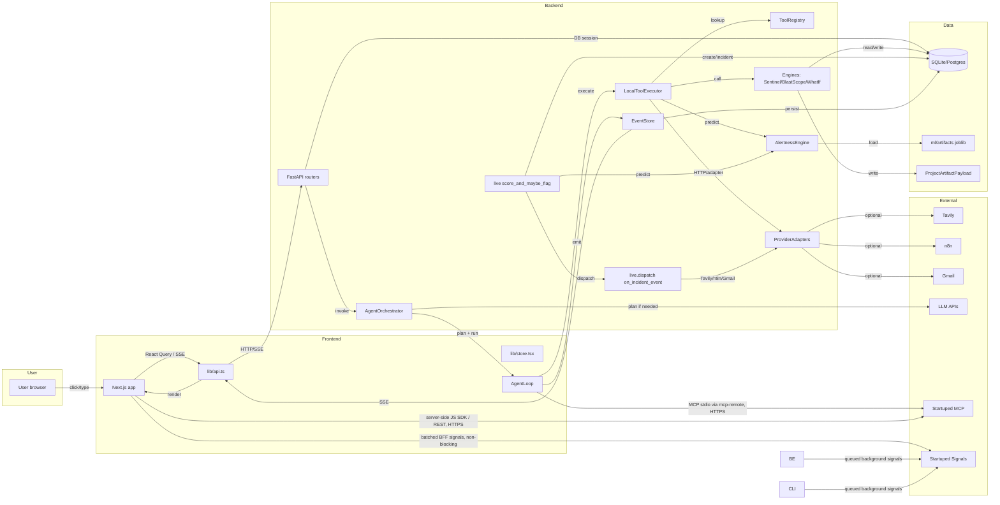

# ANVAYA — Integration Graph

> Nodes are subsystems/components. Edges are real data/event/control flows. For every edge we record: what travels, by what mechanism, what result, and under what security/error conditions.

## Integration graph (Mermaid)

## Edge inventory

### Frontend → Backend

| From | To | Data / Event | Mechanism | Result | Security / Error |
|------|-----|--------------|-----------|--------|------------------|
| `lib/api.ts` | FastAPI routers | JSON request | `fetch` with `credentials: include` | JSON response | CORS allow-list, 500 handler |
| `connectExecutionSSE` | `/agent/executions/{id}/stream` | `after` query param | `EventSource` | SSE `data:` lines | reconnect on error, fallback to polling |
| `useAgentEvents` | `/agent/executions/{id}/events` | `after` query | React Query poll 3–5s | `{items, count}` | disabled when no `executionId` |
| `useMetrics`/`useIncidents` | `/metrics`, `/incidents` | — | React Query 3s | dashboard data | keep previous data |

### Backend internal

| From | To | Data / Event | Mechanism | Result | Security / Error |
|------|-----|--------------|-----------|--------|------------------|
| `POST /telemetry` | `score_and_maybe_flag` | `TelemetryEvent` data | function call | detection dict | exception returns `scored: False` |
| `score_and_maybe_flag` | `AlertnessEngine.predict_single` | single event | method call | `{detected, score, model_id}` | no model → early return |
| `score_and_maybe_flag` | `_get_or_create_incident_for_event` | event + session | DB query/insert | `Incident` row | — |
| `score_and_maybe_flag` | `_append_detection_audit` | incident + result | insert `AuditRecord` | hash-chained record | — |
| `score_and_maybe_flag` | `on_incident_event` | incident, `DETECTED` | function call | dispatch results | gated by `is_*_enabled()` |
| `AgentOrchestrator.run` | `AgentLoop.run_investigation` | execution + plan | method call | updated `Execution` | cancellation, step failure |
| `AgentLoop` | `LocalToolExecutor.execute` | tool name + inputs | method call | `ToolResult` | exception → `ToolResult` with `execution_error` |
| `LocalToolExecutor` | `SentinelEngine` / `BlastScopeEngine` / `WhatIfEngine` | incident_id | method call | engine result dict | engine-specific error handling |
| `LocalToolExecutor` | `TavilyAdapter` / `N8NAdapter` / `GmailAdapter` | inputs | HTTP or local fallback | `dict` with `provider`, `fallback_used` | exception → fallback |
| `AgentLoop` | `EventStore.emit` | execution_id, event type | method call | `ExecutionEvent` row | exceptions swallowed to avoid breaking loop |
| `manage_artifacts` | `ArtifactBuilder.run` | artifact type, project, dataset | method call | `GenerationArtifact` + payload | stop_on_failure |
| `ArtifactBuilder` | `EventStore.emit` | build events | method call | persisted events + SSE | — |

### Backend → Data

| From | To | Data | Mechanism | Result | Error |
|------|-----|------|-----------|--------|-------|
| `init_db` | SQLite/Postgres | schema | `SQLModel.metadata.create_all` | tables created | migration conflict |
| `get_session` | DB | SQL | SQLAlchemy `Session` | session generator | — |
| `AlertnessEngine.load_latest` | `ModelVersion` + `ml/artifacts` | model_id | query + `joblib.load` | loaded model/scaler | missing artifact → `model is None` |
| `ProjectArtifactPayload` | DB | JSON payload | insert | persisted artifact | — |
| `EventStore.emit` | `ExecutionEvent` | event fields | insert | persisted event | transaction commit |

### Backend → External

| From | To | Data | Mechanism | Auth | Failure |
|------|-----|------|-----------|------|---------|
| `TavilyAdapter.search` | `https://api.tavily.com/search` | `{api_key, query, max_results}` | `httpx.post` | `TAVILY_API_KEY` | `anvaya-local-fixture` |
| `N8NAdapter.trigger` | `settings.n8n_webhook_url` | `{workflow, payload, timestamp}` | `httpx.post` | webhook URL | `anvaya-local-handler` + audit |
| `GmailAdapter.send` | Gmail API | `{to, subject, body}` | `google-api-python-client` | service-account JSON path | local `AuditRecord` |
| `LyzrAdapter.propose` | `api.lyzr.com/v2/llm/chat/completions` | messages + JSON schema | `httpx.post` | `LYZR_API_KEY` | `anvaya-local-fixture` content |
| `ModelProvider.chat_completion` | OpenAI/NVIDIA/etc. | chat messages | `httpx.post` | provider API key | fallback to deterministic planner |
| Devin `startuped-xp` skill | Startuped MCP | completed-work signal fields | stdio `mcp-remote` → HTTPS | Bearer API key from gitignored local config | tool unavailable/failure is reported but does not block product work |
| Server-side JS SDK / REST client | Startuped API | auth, account, lead, project, campaign fields | HTTPS to canonical `www` host | Bearer API key + organization header; SDK attribution header | API errors are surfaced and verified by follow-up GETs |
| ANVAYA UI / backend / CLI | Startuped Signals | behavioral, engagement, conversion, retention, and measurement events | frontend BFF or backend queue → HTTPS | Bearer API key from server-side config; no key in browser | signal failure is non-blocking and does not alter product behavior |

## Trust boundaries

1. **Browser ↔ Frontend:** no secrets stored except auth session cookie.
2. **Frontend ↔ Backend:** CORS + credentials; backend does not leak API keys.
3. **Backend ↔ DB:** same process in dev; Docker network in compose.
4. **Backend ↔ External providers:** API keys in environment; fallback never claims to be live.
5. **CLI ↔ Backend logic:** CLI runs in same Python process; no separate network boundary.
6. **Devin CLI ↔ Startuped MCP:** `mcp-remote` crosses the local-process/network boundary over HTTPS; the Bearer key remains in gitignored local configuration and only `create_signal` is auto-approved.

## Source references

- <ref_file file="/home/de3p/Documents/Next.js/Anavaya/frontend/lib/api.ts" />
- <ref_file file="/home/de3p/Documents/Next.js/Anavaya/backend/anvaya/live/__init__.py" />
- <ref_file file="/home/de3p/Documents/Next.js/Anavaya/backend/anvaya/live/dispatch.py" />
- <ref_file file="/home/de3p/Documents/Next.js/Anavaya/backend/anvaya/agent/orchestrator.py" />
- <ref_file file="/home/de3p/Documents/Next.js/Anavaya/backend/anvaya/agent/executor.py" />
- <ref_file file="/home/de3p/Documents/Next.js/Anavaya/backend/anvaya/agent/adapters.py" />
