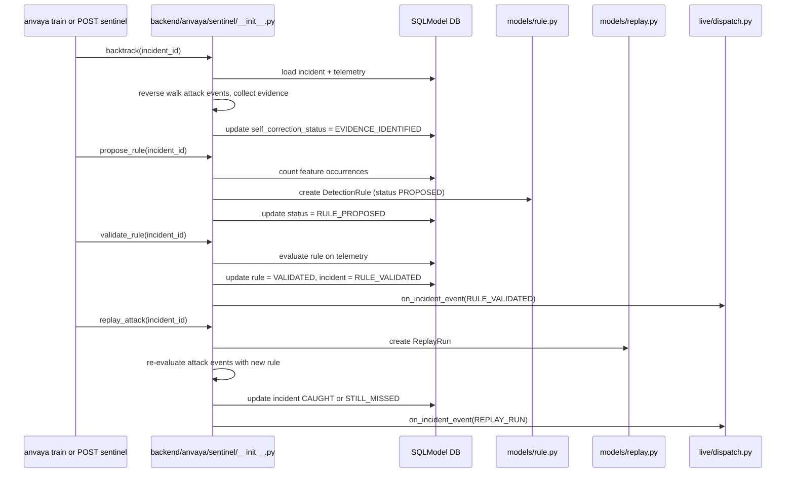
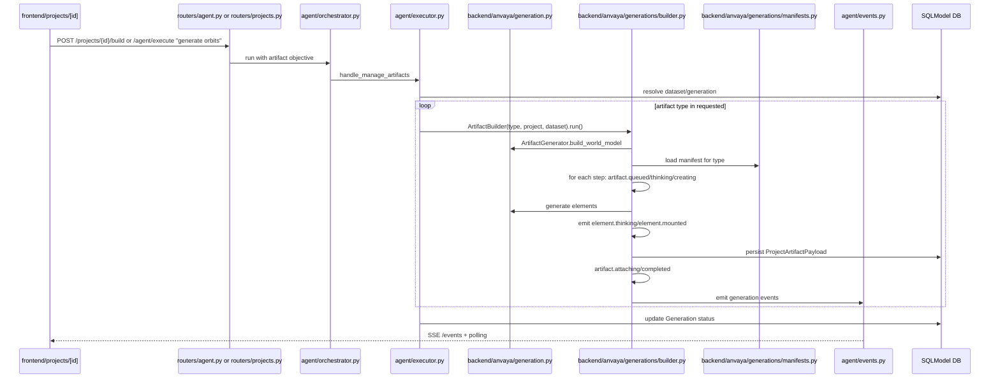
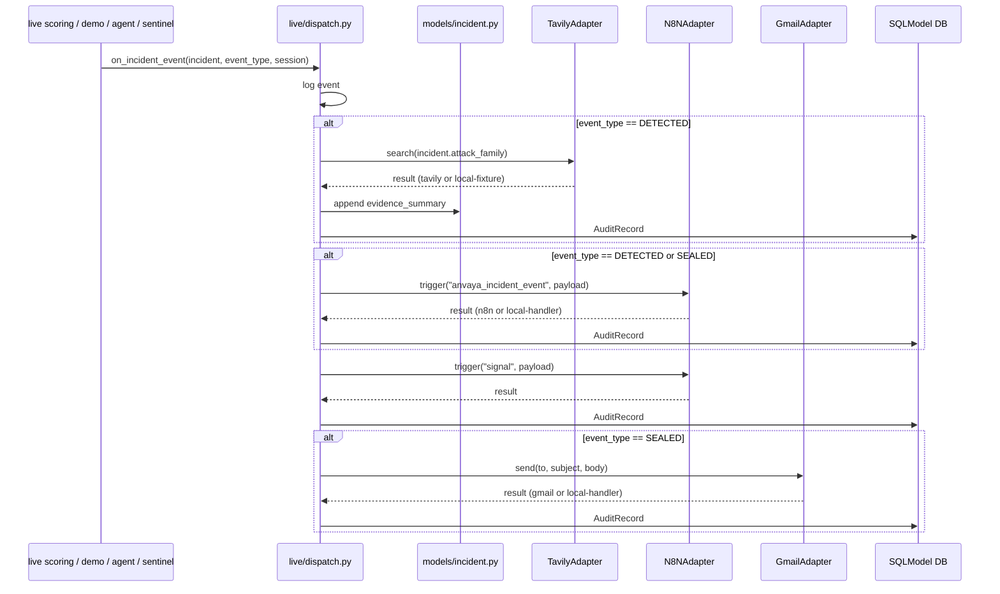
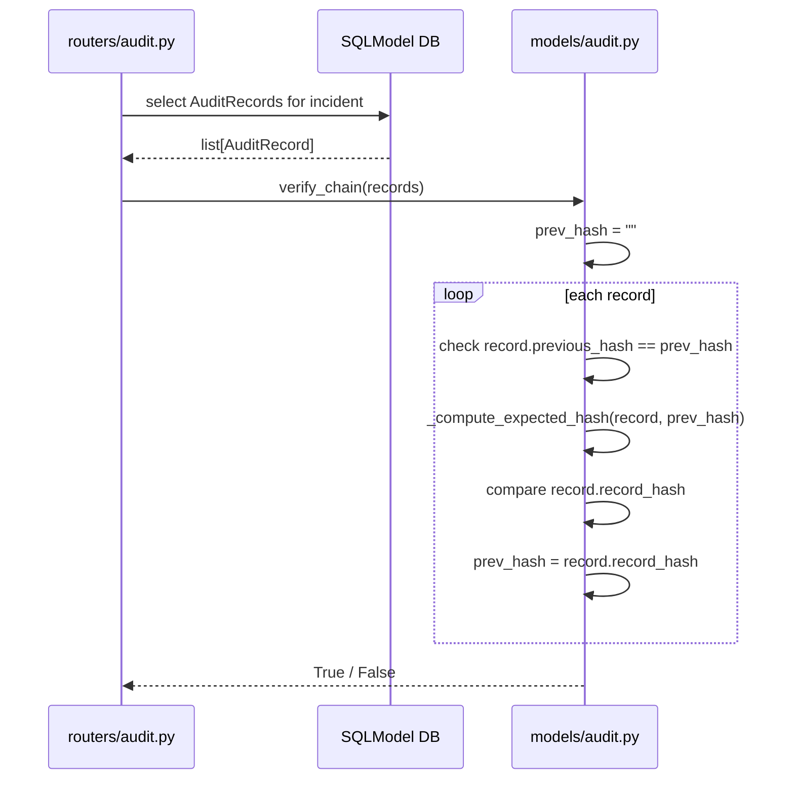

# ANVAYA — Major Data Flows

## 1. Live telemetry detection flow

```mermaid
sequenceDiagram
    participant Source as Log file / synthetic / POST
    participant Watch as cli/watch.py
    participant Tel as routers/telemetry.py
    participant Live as live/__init__.py
    AE as ml/alertness/__init__.py
    participant DB as SQLModel DB
    participant Dispatch as live/dispatch.py
    participant Adapters as agent/adapters.py

    alt anvaya watch
        Source->>Watch: log line or synthetic event
        Watch->>Watch: parse_log_line / _synthetic_event
        Watch->>Watch: _process_event_dict
    else POST /telemetry
        Source->>Tel: JSON payload
        Tel->>Tel: create TelemetryEvent
    end
    Watch->>Live: score_and_maybe_flag(event, session)
    Tel->>Live: score_and_maybe_flag(event, session)
    Live->>DB: add + commit event
    Live->>AE: AlertnessEngine.load_latest()
    AE->>DB: select ModelVersion
    AE->>AE: joblib.load model/scaler
    Live->>AE: predict_single(event)
    AE->>AE: extract_features, scale, predict, score
    AE-->>Live: {detected, score, model_id}
    alt detected = True
        Live->>DB: create or link Incident
        Live->>Live: _append_detection_audit
        Live->>DB: insert AuditRecord with hash
        Live->>Dispatch: on_incident_event(DETECTED)
        Dispatch->>Adapters: Tavily/n8n/Signal (if enabled)
        Adapters-->>Dispatch: result + fallback flags
        Dispatch->>DB: append dispatch audit record
    end
    Live-->>Tel: detection dict
    Tel-->>Source: {event, detection}
```

Sources:
- `backend/anvaya/routers/telemetry.py` `create_telemetry`
- `backend/anvaya/cli/watch.py` `_process_event_dict`
- `backend/anvaya/live/__init__.py` `score_and_maybe_flag`
- `ml/anvaya/alertness/__init__.py` `AlertnessEngine.predict_single`

## 2. Agent investigation flow

```mermaid
sequenceDiagram
    actor U as User
    participant FE as frontend components
    participant API as lib/api.ts
    participant AGT as routers/agent.py
    participant ORC as agent/orchestrator.py
    participant LOOP as agent/agent_loop.py
    participant EXE as agent/executor.py
    participant ENG as sentinel/blastscope/whatif
    participant EVT as agent/events.py
    participant DB as SQLModel DB

    U->>FE: type objective, e.g. "investigate INC-X"
    FE->>API: AnvayaAPI.agentExecute
    API->>AGT: POST /agent/execute
    AGT->>ORC: AgentOrchestrator.start
    ORC->>DB: create Execution + ExecutionContext
    ORC->>LOOP: run(execution_id, objective, ...)
    LOOP->>LOOP: select planner, build plan
    LOOP->>DB: emit agent.started, agent.plan_created
    loop each step
        LOOP->>LOOP: emit tool.started
        LOOP->>EXE: execute(tool, inputs)
        EXE->>REG: validate inputs
        EXE->>ENG: call engine
        ENG->>DB: read/write
        EXE->>DB: write AuditRecord if needed
        EXE-->>LOOP: ToolResult
        LOOP->>DB: emit tool.completed + artifact.created
        LOOP->>EVT: persist events
    end
    LOOP->>DB: complete Execution
    EVT-->>AGT: events available
    AGT-->>API: execution summary
    API->>FE: poll /events or SSE
    FE->>U: render cards, reasoning, artifacts
```

Sources:
- `backend/anvaya/routers/agent.py`
- `backend/anvaya/agent/orchestrator.py`
- `backend/anvaya/agent/agent_loop.py`
- `backend/anvaya/agent/executor.py`
- `backend/anvaya/agent/events.py`

## 3. Sentinel self-correction flow



Sources:
- `backend/anvaya/sentinel/__init__.py`
- `backend/anvaya/models/rule.py`
- `backend/anvaya/models/replay.py`

## 4. Project artifact build flow



Sources:
- `backend/anvaya/agent/executor.py` `handle_manage_artifacts`
- `backend/anvaya/generation.py`
- `backend/anvaya/generations/builder.py`
- `backend/anvaya/generations/manifests.py`

## 5. External integration dispatch flow



Sources:
- `backend/anvaya/live/dispatch.py`
- `backend/anvaya/agent/adapters.py`

## 6. Audit chain verification flow



Sources:
- `backend/anvaya/models/audit.py`
- `backend/anvaya/routers/audit.py`

## Flow comparison table

| Flow | Trigger | Main engines | Persistence | External integrations |
|------|---------|--------------|-------------|-----------------------|
| Live detection | `POST /telemetry` / `anvaya watch` | `AlertnessEngine` | `TelemetryEvent`, `Incident`, `AuditRecord` | Tavily, n8n, Signal, Gmail |
| Agent investigation | User objective / CLI `/investigate` | `AgentOrchestrator`, `AgentLoop`, `LocalToolExecutor` | `Execution`, `ExecutionEvent`, `ExecutionContext` | Tavily, n8n, Gmail, Lyzr, LLM |
| Sentinel self-correction | `/sentinel/full-cycle` or `anvaya train` | `SentinelEngine` | `DetectionRule`, `ReplayRun`, `AuditRecord` | n8n on rule validated / replay run |
| Project artifact build | `POST /projects/{id}/build` or `manage_artifacts` | `ArtifactGenerator`, `ArtifactBuilder` | `ProjectArtifact`, `ProjectArtifactPayload`, `Generation` | none (local) |
| External dispatch | `on_incident_event` | provider adapters | `AuditRecord` | Tavily, n8n, Gmail, Signal |
| Audit verification | `GET /audit/verify` | `verify_chain` | — | none |
