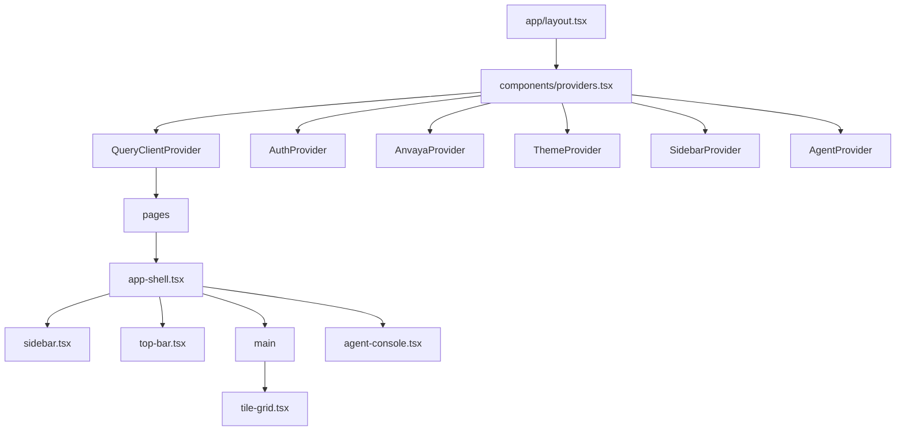

# ANVAYA — Frontend

## Stack

- **Framework:** Next.js 15.5.23 with App Router (`app/`)
- **Language:** TypeScript 5
- **Styling:** Tailwind CSS 4 (`@tailwindcss/postcss`)
- **State:** TanStack React Query 5 (`@tanstack/react-query`) + `lib/store.tsx` global reducer
- **Auth:** `better-auth` 1.7.1
- **UI components:** Radix primitives, Framer Motion, Lucide, Recharts, react-grid-layout
- **Build output:** `frontend/.next/`

## App router pages

| Route | File | Purpose |
|-------|------|---------|
| `/` | `app/page.tsx` | Redirect to `/sentinel` |
| `/sentinel` | `app/sentinel/page.tsx` | Overview, Incidents, Risk Orbits tiles |
| `/pathfinder` | `app/pathfinder/page.tsx` | Threat Ecosystem, Reach Board, Segments tiles |
| `/responder` | `app/responder/page.tsx` | Miss Replay, Nerve Arena, Impact Gallery tiles |
| `/auditor` | `app/auditor/page.tsx` | Trophy Wall, Ledger, History tiles |
| `/dashboard` | `app/dashboard/page.tsx` | SOC stats, build prompt, chart |
| `/projects` | `app/projects/page.tsx` | Project list + create |
| `/projects/[projectId]` | `app/projects/[projectId]/page.tsx` | Project workspace, datasets, artifact counts |
| `/settings` | `app/settings/page.tsx` | Polling, theme, reduced motion |
| `/sign-in`, `/sign-up`, `/create-organization`, `/organization` | auth flows | Better Auth pages |
| `/incidents`, `/overview`, `/history`, `/ledger`, etc. | `app/*/page.tsx` | Legacy redirects to workspace `#hash` |

## Layout and providers



- `app/layout.tsx:23` — root layout, Google Fonts, theme cookie read.
- `components/providers.tsx:17` — wraps all global providers.
- `components/app-shell.tsx:19` — renders sidebar, top bar, main content, agent console.
- `components/sidebar.tsx:572` — workspace navigation, projects, sessions.
- `components/top-bar.tsx:108` — page title on the left; right side renders page-level `right` slot, `UserDropdown` (user name, org/email link, sign-out), and `AgentConsoleTrigger` in that order.

## API client

`frontend/lib/api.ts` is the single source of truth for all backend communication.

```ts
const API_BASE = process.env.NEXT_PUBLIC_API_URL || "http://localhost:8000/api/v1";

async function apiFetch(path: string, options?: RequestInit, base: string = API_BASE): Promise<unknown>
```

Key features:
- `credentials: "include"`
- JSON body auto-sets `Content-Type`
- `APIError` class with method, path, status, detail
- `AnvayaAPI` object with methods for every backend route
- React Query hooks (`useMetrics`, `useIncidents`, `useAgentEvents`, `useProject*`, etc.)
- `connectExecutionSSE` for SSE streaming

## State management

### React Query

Default `QueryClient` in `components/providers.tsx`:
- `refetchInterval` defaults from settings or 4s
- `retry: 1`
- `staleTime: 2000`

`lib/api.ts` defines hooks like:
- `useMetrics(3000)`
- `useIncidents(3000)`
- `useAgentEvents(executionId, 3000)`
- `useProjectArtifactLatest(projectId, type, 3000)`

### Global UI state

`lib/store.tsx` `AnvayaProvider`:
- `connected` — backend health probe every 5s
- `activeProjectId`
- `cycles`, `arbor`, `impact`, `arena`, `orbits`, `replay`, `eco`, `segments`, `reach`, `trophy`

### Agent context

`components/agent/agent-context.tsx:464` `AgentProvider`:
- Profiles, models, executions, events, reasoning, build state
- `start`, `chat`, `chatStream`, `sendFollowUp`, `cancelExecution`, `seed`, `loadExecution`
- Opens `EventSource` to `/agent/executions/{id}/stream` (`agent-context.tsx:954`)

## Key components

| Component | File | Purpose |
|-----------|------|---------|
| `AgentConsole` | `components/agent/agent-console.tsx:90` | Conversation, build panel |
| `AgentConsoleTrigger` | `components/agent/agent-console.tsx:49` | Top-bar toggle with `SiriOrb` + `AI` label; opens/closes agent console |
| `AgentOrbButton` | `components/agent/agent-console.tsx:1083` | `SiriOrb` status icon in the agent-console header; opens provider-status panel |
| `LiveReasoningPanel` | `components/agent/live-reasoning.tsx:52` | Model status, reasoning, plan |
| `BuildPanel` | `components/build/build-panel.tsx:6` | Live artifact build UI |
| `TileGrid` | `components/tile-grid.tsx:117` | Draggable dashboard grid |
| `Sidebar` | `components/sidebar.tsx:572` | Navigation and project list |
| `TopBar` | `components/top-bar.tsx:108` | Page title and right-side controls; hosts `UserDropdown` and `AgentConsoleTrigger` |
| `UserDropdown` | `components/top-bar.tsx:19` | User name trigger; dropdown with org/email link and sign-out |
| `ProjectGuard` | `components/project-guard.tsx:10` | Force project selection |
| `CreateProjectDialog` | `components/create-project-dialog.tsx:17` | New project modal |
| `GraphCanvas` | `lib/graph.tsx:54` | Generic pan/zoom SVG graph canvas |
| `SegmentsTile` | `components/tiles/segments-tile.tsx:104` | Network segment topology tile |

## Design tokens

Source: `.devin/rules/newRules.md`

```css
:root {
  --bg: #151515;
  --surface: #201E1E;
  --surface-input: #2B2B29;
  --text-primary: #F9F9F7;
  --text-secondary: #8A8A88;
  --accent-warm: #DA7757;
  --accent-cool: #5598E7;
}
```

- One background everywhere.
- Elevation uses one step (`--surface`).
- Warm accent for brand; cool for selection/active.
- No rainbow severity palette; prefer weight/opacity.

## Agent console status orb

The agent console header no longer shows the "Agent" text label; it uses a small `SiriOrb` (`components/agent/agent-console.tsx:1083`) as the bot icon, followed by the text `Anvaya AI / <mode>` where `<mode>` is `ask` (low opacity) in `chat` mode or `agent` (low opacity) in `agentic` mode.

- The orb sits at the top-left of the console and still opens the provider-status panel on click.
- The label `Anvaya AI / <mode>` lives immediately to the right of the orb in the console header.
- The `SiriOrb` colors are now a custom, state-driven multi-color palette (`components/agent/agent-console.tsx:1039`):
  - `c1` = light shade of the **mode** color (`chat` = blue, `agentic` = orange).
  - `c2` = the **mode** color, used for the bloom.
  - `c3` = the **incident severity** color (`high` = red, `medium` = amber, `low` = green; falls back to the mode color when no incident is selected).
  - `c4` = the **model availability** color (`available` = sky, `configured` = amber, `unavailable` = gray; falls back to the mode color when no model is selected).
- Toggling ask mode, selecting a model, or selecting a different incident triggers a 650 ms `listening` `AIState` pulse (bright + slightly larger) so the orb visibly reacts.
- Execution status still drives the orb's base `AIState`: `thinking` while running, `done` on completion, `error` on failure, `idle` otherwise.

## Top-bar agent trigger

The top bar no longer shows a generic icon for opening the agent panel. `AgentConsoleTrigger` (`components/agent/agent-console.tsx:49`) is a compact `SiriOrb` + `AI` label toggle rendered by `TopBar` (`components/top-bar.tsx:125`) as the rightmost item, after the page-level `right` slot and `UserDropdown`.

- The orb sits to the left of the `AI` label, which is set in a small, medium-weight font.
- The `SiriOrb` colors use the same state-driven multi-color palette as the console-header orb (`components/agent/agent-console.tsx:1039` `getOrbColors`):
  - mode color (`chat` = blue, `agentic` = orange),
  - active incident severity (`high` = red, `medium` = amber, `low` = green),
  - selected model availability (`available` = sky, `configured` = amber, `unavailable` = gray).
- The orb's `AIState` follows execution status: `thinking` while running, `done` on completion, `error` on failure, `idle` otherwise.
- Clicking the trigger dispatches the agent console `toggle` action.
- When the console is open, the trigger border and text shift to the accent color; hovering also highlights the border/text.

## Authentication

- Client: `lib/auth-client.ts:6` creates `authClient` with `better-auth/react` + `organizationClient`.
- Server: `lib/auth.ts:27` configures `betterAuth` with `emailAndPassword` and `organization` plugins.
- API route: `app/api/auth/[...all]/route.ts:6` exposes `GET/POST` handler.
- `AuthProvider` enforces public-path redirects and exposes sign-in/out/up and org switching.

## How user actions reach the backend

| Action | Component | API call |
|--------|-----------|----------|
| Sign in | `auth-provider.tsx:110` | `authClient.signIn.email` |
| Create project | `create-project-dialog.tsx:59` | `AnvayaAPI.createProject` |
| Upload dataset | `projects/[projectId]/page.tsx:71` | `AnvayaAPI.createDataset` (FormData) |
| Generate artifacts | `projects/[projectId]/page.tsx:88` | `AnvayaAPI.createGeneration` |
| Dashboard build | `dashboard/page.tsx:30` | `AnvayaAPI.createBuildSession` |
| Agent execute | `agent-context.tsx:1061` | `AnvayaAPI.agentExecute` |
| Agent chat | `agent-context.tsx:1103` | `AnvayaAPI.agentChat` |
| Cancel execution | `agent-context.tsx:1165` | `AnvayaAPI.agentExecutionCancel` |
| Create incident | `lib/incidents.ts:92` | `AnvayaAPI.createIncident` |

## Common framework concepts

### `useQuery`

Used to keep server state fresh. Example: `useIncidents(3000)` polls `/incidents` every 3s.

**Beginner:** like a waiter who checks the kitchen every few seconds and brings the latest plate.
**Anvaya example:** `frontend/lib/api.ts:282` `useIncidents`.
**Why it exists:** dashboards need live-ish data without manual refresh.
**What breaks if it changes:** stale data, too much or too little polling.

### `useEffect`

Used for side effects (SSE connect, health probe). Example: `components/agent/agent-context.tsx:954` opens EventSource.

**Beginner:** a timer that does something when the user visits a page.
**Anvaya example:** opening SSE stream and cleaning up on unmount.
**Why it exists:** connect to live backend events.
**What breaks if it changes:** memory leaks, missed events, extra reconnects.

### Server-Sent Events (SSE)

`lib/api.ts:643` `connectExecutionSSE` opens `EventSource` to `/agent/executions/{id}/stream`.

**Beginner:** the backend keeps a one-way radio channel open and sends updates.
**Anvaya example:** live tool execution events in the agent console.
**Why it exists:** real-time progress without WebSocket complexity.
**What breaks if it changes:** events out of order, disconnect, no live UI.

### Next.js App Router

Files in `app/` define routes. Layouts wrap nested pages.

**Beginner:** the file path is the URL.
**Anvaya example:** `app/sentinel/page.tsx` → `https://.../sentinel`.
**Why it exists:** colocated routing, layouts, server components.
**What breaks if it changes:** broken URLs, lost layout state.

## Active recall

- What is the default backend URL used by `lib/api.ts`?
- Which provider wraps the global React state?
- How does the agent console receive live events?
- What is the route map pattern for legacy pages?
- Which file defines all frontend-to-backend API methods?

## Source references

- <ref_file file="/home/de3p/Documents/Next.js/Anavaya/frontend/package.json" />
- <ref_file file="/home/de3p/Documents/Next.js/Anavaya/frontend/lib/api.ts" />
- <ref_file file="/home/de3p/Documents/Next.js/Anavaya/frontend/lib/store.tsx" />
- <ref_file file="/home/de3p/Documents/Next.js/Anavaya/frontend/components/providers.tsx" />
- <ref_file file="/home/de3p/Documents/Next.js/Anavaya/frontend/components/app-shell.tsx" />
- <ref_file file="/home/de3p/Documents/Next.js/Anavaya/frontend/components/agent/agent-context.tsx" />
- <ref_file file="/home/de3p/Documents/Next.js/Anavaya/.devin/rules/newRules.md" />
