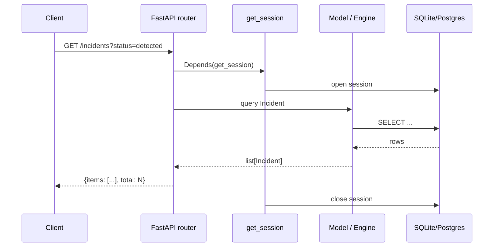

# ANVAYA — Backend

## FastAPI application

`backend/anvaya/main.py` constructs the app.

```python
app = FastAPI(
    title="ANVAYA",
    description="Autonomous Cyber SOC Platform",
    version="0.1.0",
    lifespan=lifespan,
)
```

Lifespan:
- `configure_logging(settings.log_level)`
- `init_db()`
- log startup with database URL and LLM enabled flag

Middleware:
- `CORSMiddleware` with `settings.cors_origins`
- Security headers: `X-Content-Type-Options`, `X-Frame-Options`, `Strict-Transport-Security`
- Global exception handler returns 500 JSON

Router mount:
```python
prefix = "/api/v1"
app.include_router(incidents.router, prefix=prefix, ...)
# ... 17 routers
```

## Router inventory

| Router | File | Main responsibilities |
|--------|------|----------------------|
| incidents | `routers/incidents.py` | CRUD, status/self-correction transitions |
| telemetry | `routers/telemetry.py` | Ingest events, call `score_and_maybe_flag` |
| detections | `routers/detections.py` | List `DetectionRun`/`DetectionResult` |
| rules | `routers/rules.py` | List/create `DetectionRule` |
| replay | `routers/replay.py` | List `ReplayRun` |
| sentinel | `routers/sentinel.py` | Backtrack, propose, validate, replay, full-cycle |
| blastscope | `routers/blastscope.py` | Run blast-radius, gallery |
| whatif | `routers/whatif.py` | Counterfactual analysis |
| audit | `routers/audit.py` | List records, verify chain |
| graph | `routers/graph.py` | Graph nodes/edges/segments/reachability |
| metrics | `routers/metrics.py` | Aggregate SOC KPIs |
| models | `routers/models.py` | `ModelVersion` list/get |
| projects | `routers/projects.py` | Projects, datasets, artifact generation |
| datasets | `routers/datasets.py` | `DatasetVersion` list, generate datasets |
| demo | `routers/demo.py` | Run full demo orchestrator |
| simulation | `routers/simulation.py` | Ecosystem step simulation |
| agent | `routers/agent.py` | Agent execution, chat, tools, executions, subagents |

## Dependency injection

```python
from anvaya.db import get_session

@router.get("/incidents")
def list_incidents(db_session: Session = Depends(get_session)):
    ...
```

`get_session` is a generator yielding a SQLModel `Session`. `get_session_sync` returns a synchronous `Session` for the CLI.

Auth is only used in `routers/projects.py`:
```python
from anvaya.auth import get_auth_context

@router.get("/projects")
def list_projects(auth: AuthContext = Depends(get_auth_context), db_session: Session = Depends(get_session)):
    ...
```

## Service layer

The backend has no dedicated `services/` package. Routers call:
- SQLModel models directly for simple CRUD.
- Engine classes (`SentinelEngine`, `BlastScopeEngine`, `WhatIfEngine`) for analysis.
- `DataFactory` for dataset generation.
- `AgentOrchestrator` for agentic execution.
- `ArtifactGenerator`/`ArtifactBuilder` for project artifact builds.

## Engine classes

| Engine | Package | Primary methods |
|--------|---------|-----------------|
| `AlertnessEngine` | `ml/anvaya/alertness/__init__.py` | `train`, `predict`, `predict_single`, `load_latest` |
| `WhatIfEngine` | `backend/anvaya/whatif/__init__.py` | `train`, `score_event`, `analyze`, `load_latest` |
| `SentinelEngine` | `backend/anvaya/sentinel/__init__.py` | `backtrack`, `propose_rule`, `validate_rule`, `replay_attack`, `run_full_cycle` |
| `BlastScopeEngine` | `backend/anvaya/blastscope/__init__.py` | `build_graph`, `run`, `get_result` |
| `ArtifactGenerator` | `backend/anvaya/generation.py` | `generate_all`, `build_world_model` |
| `ArtifactBuilder` | `backend/anvaya/generations/builder.py` | `run` (per artifact type) |

## Request/response patterns

Most routers use plain `dict` bodies and return `model.model_dump()` or aggregate dicts. Example from `routers/telemetry.py`:

```python
@router.post("/telemetry")
def create_telemetry(data: dict, db_session: Session = Depends(get_session)):
    event = TelemetryEvent(...)
    db_session.add(event)
    db_session.commit()
    detection = score_and_maybe_flag(event, db_session)
    return {"event": event.model_dump(), "detection": detection}
```

## Key backend concepts

### FastAPI dependencies

**Beginner:** a way to ask for something (like a database connection) every time a request comes in.
**Anvaya example:** `db_session: Session = Depends(get_session)` in nearly every router.
**Why it exists:** consistent session lifecycle and easy testing/mocking.
**What breaks if it changes:** sessions not closed, test fixtures fail.

### SQLModel

**Beginner:** tables in the database are described as Python classes.
**Anvaya example:** `class Incident(SQLModel, table=True): ...`
**Why it exists:** typed models, Pydantic validation, SQLAlchemy compatibility.
**What breaks if it changes:** schema mismatches, migration errors.

### Lifespan

**Beginner:** code that runs when the server starts and stops.
**Anvaya example:** `init_db()` on startup, logging on shutdown.
**Why it exists:** setup/teardown without global side effects.
**What breaks if it changes:** tables missing, logging misconfigured.

## Backend data flow example



## Active recall

- What is the API prefix for all routers?
- Which router handles live telemetry ingestion?
- Which router uses `get_auth_context`?
- What does the global exception handler return?
- What is the lifespan function responsible for?

## Source references

- <ref_file file="/home/de3p/Documents/Next.js/Anavaya/backend/anvaya/main.py" />
- <ref_file file="/home/de3p/Documents/Next.js/Anavaya/backend/anvaya/routers/incidents.py" />
- <ref_file file="/home/de3p/Documents/Next.js/Anavaya/backend/anvaya/routers/telemetry.py" />
- <ref_file file="/home/de3p/Documents/Next.js/Anavaya/backend/anvaya/routers/projects.py" />
- <ref_file file="/home/de3p/Documents/Next.js/Anavaya/backend/anvaya/db.py" />
- <ref_file file="/home/de3p/Documents/Next.js/Anavaya/backend/anvaya/auth.py" />
