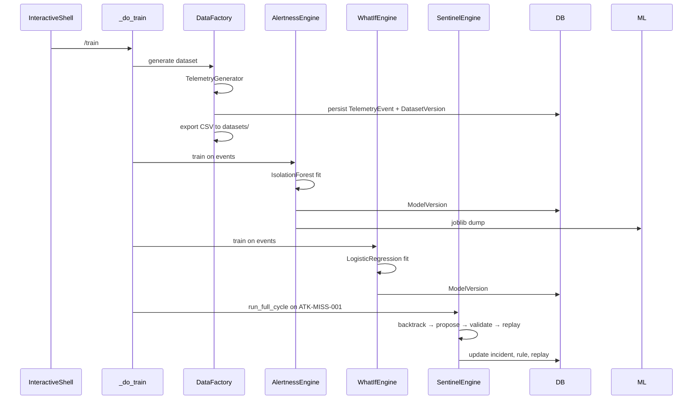
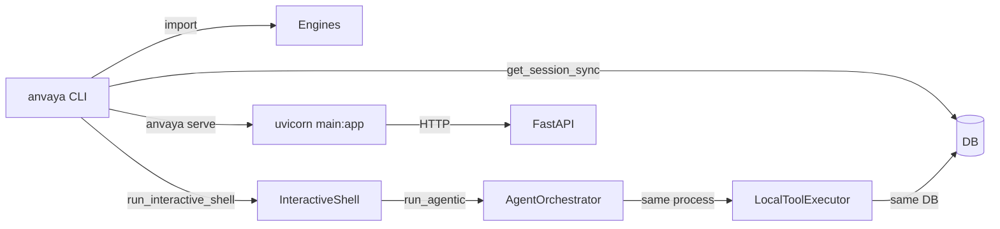

# ANVAYA — CLI / Control Plane

## Entry points

`backend/anvaya/cli/main.py` is the main entry.

```python
def main() -> None:
    configure_logging(settings.cli_log_level, human=True)
    if len(sys.argv) == 1:
        run_interactive_shell()
        return
    from anvaya.cli import app
    app()
```

Two modes:
1. **Interactive shell** when `anvaya` is called with no arguments.
2. **Typer subcommands** for `anvaya <cmd>`.

## Typer commands

From `backend/anvaya/cli/typer_app.py`:

| Command | Function | Description |
|---------|----------|-------------|
| `anvaya demo` | `demo()` | Run `DemoOrchestrator.run_full_demo()` with Rich step narration |
| `anvaya data` | `data()` | Generate or load a dataset |
| `anvaya train` | `train()` | Generate dataset, train Alertness + What-If, run Sentinel cycle with narration |
| `anvaya evaluate` | `evaluate()` | Evaluate a trained model on a dataset |
| `anvaya world` | `world()` | Generate world manifest |
| `anvaya models` | `models()` | Model catalog operations |
| `anvaya watch` | `watch()` | Real-time log tail or synthetic feed |
| `anvaya serve` | `serve()` | Start uvicorn FastAPI server |
| `anvaya demo-batch` | `demo_batch()` | Run the full lifecycle across a batch of varied incidents |

## Demo / batch demo narration

`anvaya demo` now streams step-level narration via a live `on_step` callback on `DemoOrchestrator.run_full_demo()`. Each block explains what was checked, what was found, and what it means, using the real result fields from the orchestrator and Sentinel engine. A `--delay` option slows output for live-demo pacing.

`anvaya demo-batch` trains models once, then cycles through the four `ATK-*` scenario templates with varied actor, host, seed, and timestamp to produce the requested count of distinct-looking incidents. The first `N` incidents (default 2) are narrated in full detail; the rest are summarized as one line per incident and a final batch table.

## Interactive shell

`backend/anvaya/cli/shell.py` `InteractiveShell` provides a `prompt_toolkit` REPL.

Startup:
- `init_db()`
- auto-select default model
- print startup banner
- loop: read input → `_handle` → dispatch

Input handling in `InteractiveShell._handle`:
1. `parse_input(text)`
2. If slash command: look up `CommandRegistry`, call `getattr(self, command.handler)(args)`
3. If chat mode: `run_chat`
4. Otherwise: `run_agentic`

## Slash commands

Selected from `backend/anvaya/cli/commands.py`:

| Command | Handler | Purpose |
|---------|---------|---------|
| `/help` | `_do_help` | List commands |
| `/train` | `_do_train` | Dataset + train + Sentinel cycle |
| `/investigate` | `_do_investigate` | Run agentic objective |
| `/project` | `_do_project` | Select project |
| `/incident` | `_do_incident` | Select incident |
| `/model` | `_do_model` | Select model |
| `/profile` | `_do_profile` | Select agent profile |
| `/artifact` | `_do_artifact` | Artifact command center |
| `/orbit`, `/ecosystem`, `/replay`, etc. | `_do_orbit`, etc. | Per-artifact operations |
| `/history` | `_do_history` | List executions |
| `/shell` | `_do_shell` | Run local shell command |
| `/status` | `_do_status` | Show CLI status |
| `/quit` | `_do_quit` | Exit |

## `/train` command flow



## `anvaya watch`

`backend/anvaya/cli/watch.py`:

- `run_watch` initializes DB and session.
- Modes:
  - `_tail_and_score` — tail a real log file.
  - `_synthetic_feed` — generate synthetic attack traffic.
- `_ensure_model_trained` loads or trains an `AlertnessEngine`.
- `_process_event_dict` creates `TelemetryEvent`, persists, calls `score_and_maybe_flag`.
- `_print_event_summary` prints `[DETECTED]` or `[normal]`.

Log line parsing supports:
- JSON lines
- Pipe-delimited format (`_PIPE_FIELDS` in `watch.py:28-46`)
- Boolean normalization (`_BOOL_FIELDS` in `watch.py:48-56`)

## CLI state

`backend/anvaya/cli/state.py` `CLIState`:
- `project_id`, `project_name`
- `incident_id`
- `model_id`, `model_display`, `model_provider`
- `profile_id` (default `sentinel`)
- `active_execution_id`
- `file_contexts`, `search_context`, `search_results`
- `recent_commands`
- `debug`, `mode` (`agentic` or `chat`)

Persistence:
- `save()` writes `~/.config/anvaya/cli.json` with `0o600` permissions.
- `load()` reads the file or returns defaults.
- `add_command()` filters out lines that look like secrets (`/set-key`, `api-key`, `token`, `secret`, or containing `=` / `sk-` / `api` with `key`).

## How the CLI talks to the backend

The CLI does **not** use HTTP for normal operations. It imports the same Python classes and uses the same `get_session_sync()` database session.



Only `anvaya serve` starts a network backend.

## Active recall

- What are the two CLI entry modes and how are they chosen?
- What does `anvaya watch` do when no log file is provided?
- Where is CLI state saved?
- How does the CLI run an agentic objective?
- Which command starts the FastAPI server?

## Source references

- <ref_file file="/home/de3p/Documents/Next.js/Anavaya/backend/anvaya/cli/main.py" />
- <ref_file file="/home/de3p/Documents/Next.js/Anavaya/backend/anvaya/cli/typer_app.py" />
- <ref_file file="/home/de3p/Documents/Next.js/Anavaya/backend/anvaya/cli/shell.py" />
- <ref_file file="/home/de3p/Documents/Next.js/Anavaya/backend/anvaya/cli/commands.py" />
- <ref_file file="/home/de3p/Documents/Next.js/Anavaya/backend/anvaya/cli/watch.py" />
- <ref_file file="/home/de3p/Documents/Next.js/Anavaya/backend/anvaya/cli/state.py" />
