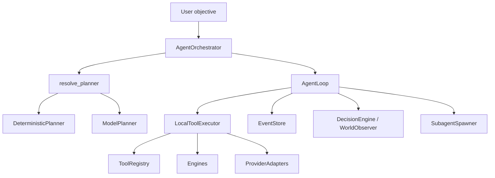

# ANVAYA — Orchestration and Logistics

## Agentic orchestration



## AgentOrchestrator

`backend/anvaya/agent/orchestrator.py`:

- `start()` creates an `Execution` and `ExecutionContext`.
- `run()`:
  1. Resolves incident / project ID from objective.
  2. Detects artifact-generation objectives (`infer_artifact_types`).
  3. Chooses `_run_mixed_plan`, `_run_project_plan`, or `run_investigation`.
  4. Resolves planner (deterministic or model-backed).
  5. Runs `AgentLoop`.

## Planners

### DeterministicPlanner

`backend/anvaya/agent/planner.py:29`:
- Delegates to `orchestrator._build_plan`.
- Builds a fixed sequence of investigation tools based on incident state.

### ModelPlanner

`backend/anvaya/agent/planner.py:47`:
- Calls a configured `ModelProvider.chat_completion`.
- Receives a JSON plan, validates each step against `ToolRegistry`.
- Falls back to `DeterministicPlanner` if model fails or plan is invalid.

### resolve_planner

`backend/anvaya/agent/planner.py:222`:
- If a capable, configured external model is available, use `ModelPlanner`.
- Otherwise `DeterministicPlanner`.

## AgentLoop

`backend/anvaya/agent/agent_loop.py`:

### run_investigation

- Initializes `ExecutionContext`.
- Emits `agent.started`, `agent.plan_created`, `agent.message`.
- Loops over plan steps:
  - emit `tool.started`
  - emit `agent.reasoning` (via `ReasoningGenerator`)
  - emit `agent.decision_started`
  - emit `agent.tool_requested`
  - execute tool via `LocalToolExecutor`
  - build observation
  - emit `agent.observation_created`
  - update `ExecutionContext`
- Emits `incident.updated` and `agent.completed`.

### run_project_plan

- Handles artifact-generation objectives.
- Builds one `manage_artifacts` step per artifact type via `_build_artifact_steps`.
- Emits per-artifact build events.

### run_adaptive

- Uses `WorldObserver`, `DecisionEngine`, `MemoryStore`.
- Decides next action (`tool`, `replan`, `complete`, `ask_user`) per step.

## LocalToolExecutor

`backend/anvaya/agent/executor.py`:

- `execute(tool_name, inputs, ...)` looks up `handle_<tool_name>`.
- Wraps every call in a timed `ToolResult`.
- Emits `tool.started`, `tool.progress`, `tool.completed`/`tool.failed`, `artifact.created`.
- Key handlers:
  - `handle_get_incident`
  - `handle_get_telemetry`
  - `handle_run_sentinel_trace`
  - `handle_propose_rule`
  - `handle_validate_rule`
  - `handle_run_replay`
  - `handle_run_blastscope`
  - `handle_run_what_if`
  - `handle_manage_artifacts`
  - `handle_threat_intelligence_lookup`
  - `handle_trigger_automation`
  - `handle_notify_via_email`
  - `handle_seal_incident`
  - `handle_spawn_subagent`
  - `handle_run_tests`

## Tool registry

`backend/anvaya/agent/registry.py`:

- `ToolRegistry` in-memory dict keyed by name.
- `validate_inputs` checks required, type, enum.
- `default_tool_registry()` registers ~40 tools with `provider` and `fallback_provider`.

## EventStore

`backend/anvaya/agent/events.py`:

- Persists `ExecutionEvent` rows.
- Maintains an in-memory cache for fast SSE.
- Methods: `create_execution`, `emit`, `complete_execution`, `get_events`, `next_sequence`.
- SSE endpoint in `routers/agent.py` streams from cache + DB.

## Subagents

`backend/anvaya/agent/subagents.py`:

- `SubagentSpawner` spawns child executions via `AgentOrchestrator`.
- Modes: `foreground` (blocking) or `background`.
- Emits `subagent.spawned`, `started`, `completed`, `failed`, `cancelled`.
- Tracks parent/child `execution_id`, nesting depth.

## Retries and idempotency

- Tool definitions declare `idempotent`.
- `ArtifactBuilder` retries failed steps.
- External adapter calls are wrapped in try/except and fallback; no blind retry for non-idempotent mutations.

## DemoOrchestrator

`backend/anvaya/demo/orchestrator.py`:

- `DemoOrchestrator` now provides two entry points:
  - `run_full_demo(on_step=None)` — single self-correction incident with optional live step callback.
  - `run_batch_demo(count=20, scenarios='all', on_step=None, on_incident=None)` — models trained once, then `count` incidents produced from the four `ATK-*` templates with varied actor, host, seed, and timestamp.
- Shared helpers:
  - `_generate_background_and_train` — dataset + Alertness + What-If.
  - `_run_single_incident` — generate telemetry, create incident, pre-patch detection, optional self-correction, BlastScope, What-If, seal, verify audit.
  - `_run_self_correction`, `_run_blastscope`, `_run_whatif`, `_seal_incident`, `_verify_audit_chain`.
- Callbacks:
  - `on_step(step_name, step_result)` is called after every step append; per-incident calls include `batch_index`.
  - `on_incident(incident_result)` is called after each incident completes in batch mode.

## State machines

### Incident lifecycle

```text
detected → analyzed → simulated → explained → sealed
```

### Self-correction

```text
none → miss → ground_truth_confirmed → backtracking → evidence_identified → rule_proposed → rule_validated → replaying → caught | still_missed
```

### Generation status

```text
pending → running → completed | failed
```

## Active recall

- What is the difference between `AgentLoop.run_investigation` and `run_project_plan`?
- When is `ModelPlanner` chosen over `DeterministicPlanner`?
- How does `LocalToolExecutor` find a handler?
- What does `EventStore.emit` persist?
- What are the two subagent modes?

## Source references

- <ref_file file="/home/de3p/Documents/Next.js/Anavaya/backend/anvaya/agent/orchestrator.py" />
- <ref_file file="/home/de3p/Documents/Next.js/Anavaya/backend/anvaya/agent/agent_loop.py" />
- <ref_file file="/home/de3p/Documents/Next.js/Anavaya/backend/anvaya/agent/executor.py" />
- <ref_file file="/home/de3p/Documents/Next.js/Anavaya/backend/anvaya/agent/registry.py" />
- <ref_file file="/home/de3p/Documents/Next.js/Anavaya/backend/anvaya/agent/events.py" />
- <ref_file file="/home/de3p/Documents/Next.js/Anavaya/backend/anvaya/agent/planner.py" />
- <ref_file file="/home/de3p/Documents/Next.js/Anavaya/backend/anvaya/agent/subagents.py" />
- <ref_file file="/home/de3p/Documents/Next.js/Anavaya/backend/anvaya/models/incident.py" />
