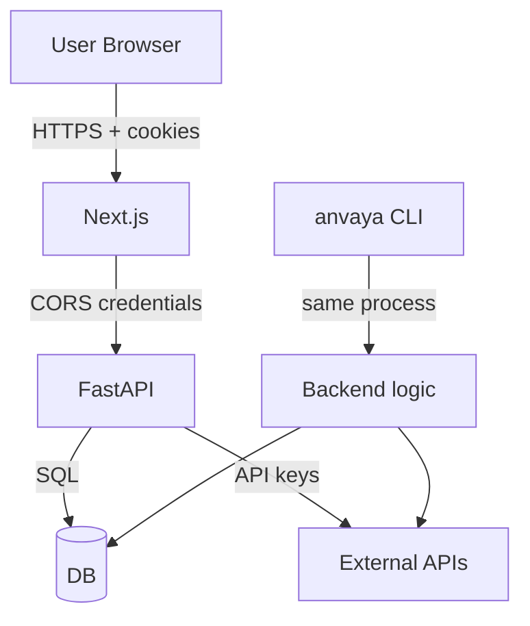

# ANVAYA — Security Model

## Trust boundaries

1. **Browser → Frontend:** no secrets; auth session cookie.
2. **Frontend → Backend:** CORS allow-list, credentials include; backend does not leak keys.
3. **Backend → Database:** shared process/container; SQLAlchemy sessions.
4. **Backend → External providers:** API keys in env; fallback on failure.
5. **CLI → Backend logic:** same Python process, same DB.

## Authentication

- **Better Auth** in `frontend/lib/auth.ts` and `frontend/app/api/auth/[...all]/route.ts`.
- `backend/anvaya/auth.py` validates session tokens with HMAC-SHA256 using `BETTER_AUTH_SECRET`.
- Returns `AuthContext` with `active_organization_id` and `member_role`.
- Only `routers/projects.py` currently enforces auth.

## Authorization

- Projects router filters by `active_organization_id`.
- Agent tools use `risk_level` and `requires_confirmation`:
  - `low` risk: automatic.
  - `medium`: may require confirmation depending on profile.
  - `high`/`critical`: `requires_confirmation=True`.
- `ToolRegistry.validate_inputs` enforces parameter types and enums.

## Audit / ControlLedger

`backend/anvaya/models/audit.py`:

- Each `AuditRecord` is hash-chained to the previous record.
- `compute_hash(prev_hash)`:
  1. Canonical JSON payload sorted by keys.
  2. `payload_hash = sha256(payload_str)`.
  3. `record_hash = sha256(payload_hash + previous_hash)`.
- `verify_chain(records)` detects any break.
- Records are written by:
  - live scoring
  - Sentinel state changes
  - agent actions
  - external integration dispatch
  - `seal_incident`

## Input validation

- `ToolRegistry.validate_inputs` checks required, type, enum.
- `LocalToolExecutor.execute` looks up `handle_<tool>`; unknown tools return `tool_not_found`.
- `pydantic` models validate request data where used.
- LLM outputs are parsed as JSON and validated against schemas, not `eval`ed or executed.

## Output safety

- `AGENT_EXECUTION_EVENTS.md` defines the safe output policy.
- Frontend must not receive: API keys, provider credentials, hidden chain-of-thought, internal stack traces, unnecessary raw third-party content.
- `rehype-sanitize` sanitizes rendered markdown in the frontend.

## Secrets handling

- Secrets loaded from `.env` / `.env.local` into `Settings`.
- `Settings` fields: `openai_api_key`, `tavily_api_key`, `n8n_webhook_url`, `gmail_credentials_path`, etc.
- Frontend env: only `NEXT_PUBLIC_API_URL`.
- `anvaya_auth.db` is SQLite with Better Auth tables.

## Threats and mitigations

| Threat | Surface | Mitigation |
|--------|---------|------------|
| Credential leak | `.env`, source | never commit real keys; `.env.local` ignored |
| XSS | markdown rendering | `rehype-sanitize` |
| CSRF | API calls | CORS allow-list, `credentials: include` |
| Unauthorized DB mutation | agent tools | tool allowlist, validation, confirmation |
| Arbitrary code execution | `_do_shell` | runs with user privileges; not exposed via API |
| Fake provider attribution | adapters | `fallback_used` + `fallback_reason` always set |
| Audit tampering | `AuditRecord` | hash chain; `verify_chain` |
| Prompt injection | LLM planner | deterministic fallback; schema validation |
| LLM output execution | agent | no `exec`, no `eval`, allowlisted tools only |
| Startuped API key disclosure | `.devin/mcp_config.local.json` | project `.gitignore` excludes `.devin/*.local.json`; CLI redacts env values |
| Unapproved Startuped side effects | Startuped MCP tools | only `mcp__startuped-ai__create_signal` is auto-approved; all other tools still require confirmation |

## Startuped MCP security review

- **Trust boundary:** local Devin CLI/stdio proxy to external `mcp.startuped.ai` over HTTPS.
- **Privileges:** only `mcp__startuped-ai__create_signal` is auto-approved; lead, deal, and social tools are not.
- **Attacker-controlled input:** signal text may originate from task context; the skill requires factual, completed-work descriptions and disallows invented metrics.
- **Command execution:** Devin launches `npx -y mcp-remote`; no Startuped response is evaluated as code.
- **Network access:** outbound HTTPS to the configured Startuped MCP endpoint and npm access when `npx` resolves the proxy.
- **Filesystem access:** API key is confined to `.devin/mcp_config.local.json`; `.devin/*.local.json` is ignored.
- **Authentication:** Bearer API key supplied through `AUTH_HEADER`.
- **Authorization:** Startuped enforces key permissions; local Devin config narrowly auto-approves only signal creation.
- **Secret handling:** key is not stored in shared MCP config, skill, docs, or command output; local config must not be committed.
- **Injection risk:** header interpolation uses a single environment variable; signal fields remain structured MCP arguments.
- **Sandbox escape risk:** no additional sandbox or filesystem privilege is granted by this configuration.
- **Denial-of-service risk:** skill forbids loops and limits calls to one per distinct shipped unit.
- **Logging/auditability:** successful calls return a signal ID; Devin records tool results while redacting config environment values.
- **Failure containment:** Startuped/MCP failure does not block the underlying engineering task.
- **SDK boundary:** `@startuped-ai/sdk` is server-side only; the verification call sourced the key at runtime from ignored local configuration, used the canonical HTTPS host, and explicitly injected `X-Startuped-Client: sdk-js`. The key must never enter browser bundles or `NEXT_PUBLIC_*` variables.
- **Behavioral signal boundary:** UI signals go through the same-origin BFF; backend and CLI signals are queued to a daemon worker. The Startuped key never reaches the browser, signal payloads are reduced to safe event names and scalar metadata, and backend delivery is disabled automatically while pytest is running.

## Active recall

- How is the audit chain verified?
- Where is the Better Auth session validated on the backend?
- What is the only `NEXT_PUBLIC_*` env var the frontend needs?
- Which tool risk level requires confirmation?
- What prevents the agent from running arbitrary shell commands?

## Source references

- <ref_file file="/home/de3p/Documents/Next.js/Anavaya/backend/anvaya/models/audit.py" />
- <ref_file file="/home/de3p/Documents/Next.js/Anavaya/backend/anvaya/auth.py" />
- <ref_file file="/home/de3p/Documents/Next.js/Anavaya/backend/anvaya/agent/registry.py" />
- <ref_file file="/home/de3p/Documents/Next.js/Anavaya/backend/anvaya/main.py" />
- <ref_file file="/home/de3p/Documents/Next.js/Anavaya/AGENT_EXECUTION_EVENTS.md" />
- <ref_file file="/home/de3p/Documents/Next.js/Anavaya/.devin/rules/04-security.md" />
