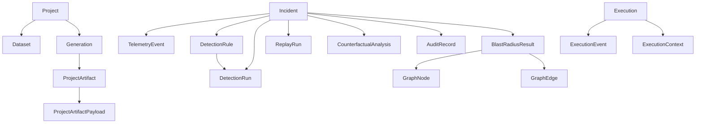

# ANVAYA — Database and State

## Database engine

`backend/anvaya/db.py`:

```python
engine = create_engine(
    settings.database_url,
    echo=_database_log_level == logging.DEBUG,
    connect_args={"check_same_thread": False} if settings.is_sqlite() else {},
)
```

- SQLite by default (`sqlite:///./anvaya.db`).
- PostgreSQL in Docker Compose and production.
- SQLite runs with `PRAGMA journal_mode=WAL`.

## Init and migrations

`init_db()`:
1. Import all model modules.
2. `SQLModel.metadata.create_all(engine)`.
3. `apply_sqlite_migrations(engine)` for idempotent column-only SQLite patches.
4. PostgreSQL migrations should use Alembic (noted in `migrations.py`).

## Domain models

Core tables from `backend/anvaya/models/__init__.py`:

| Model | File | Purpose |
|-------|------|---------|
| `Incident` | `models/incident.py` | SOC incident with lifecycle |
| `TelemetryEvent` | `models/telemetry.py` | Raw telemetry events |
| `DetectionRule` | `models/rule.py` | Proposed/validated rules |
| `DetectionRun`/`DetectionResult` | `models/detection.py` | Batch detection results |
| `ReplayRun` | `models/replay.py` | Sentinel replay records |
| `AuditRecord` | `models/audit.py` | Hash-chained audit |
| `Asset`/`AssetRelationship` | `models/asset.py` | BlastScope asset graph |
| `GraphNode`/`GraphEdge` | `models/graph.py` | Persisted graph |
| `BlastRadiusResult` | `models/graph.py` | Blast-scope metrics |
| `CounterfactualAnalysis` | `models/counterfactual.py` | What-If results |
| `ModelVersion` | `models/model_version.py` | Trained model metadata |
| `Project`/`Dataset`/`Generation` | `models/project.py` | Multi-tenant projects |
| `ProjectArtifact`/`ProjectArtifactPayload` | `models/project.py` | Generated artifacts |
| `Execution`/`ExecutionEvent`/`ExecutionContext` | `models/execution.py`, `models/agent_context.py` | Agent runs |
| `SubagentExecution` | `models/subagent.py` | Subagent records |

## Key state machines

### Incident lifecycle

```python
LIFECYCLE_TRANSITIONS = {
    DETECTED: [ANALYZED],
    ANALYZED: [SIMULATED],
    SIMULATED: [EXPLAINED],
    EXPLAINED: [SEALED],
    SEALED: [],
}
```

### Self-correction

```python
SELF_CORRECTION_TRANSITIONS = {
    NONE: [MISS],
    MISS: [GROUND_TRUTH_CONFIRMED],
    GROUND_TRUTH_CONFIRMED: [BACKTRACKING],
    BACKTRACKING: [EVIDENCE_IDENTIFIED],
    EVIDENCE_IDENTIFIED: [RULE_PROPOSED],
    RULE_PROPOSED: [RULE_VALIDATED, STILL_MISSED],
    RULE_VALIDATED: [REPLAYING],
    REPLAYING: [CAUGHT, STILL_MISSED],
    CAUGHT: [],
    STILL_MISSED: [BACKTRACKING],
}
```

### Dataset status

`INGESTING → READY | ERROR`

### Generation status

`PENDING → RUNNING → COMPLETED | FAILED`

## Schema relationships



## Active recall

- What is the default database and where is it configured?
- What does `init_db` do beyond `create_all`?
- Which two models store the graph for BlastScope?
- What is the primary key style? (`id` auto-increment, `incident_id` string)
- Where are artifact payloads stored?

## Source references

- <ref_file file="/home/de3p/Documents/Next.js/Anavaya/backend/anvaya/db.py" />
- <ref_file file="/home/de3p/Documents/Next.js/Anavaya/backend/anvaya/migrations.py" />
- <ref_file file="/home/de3p/Documents/Next.js/Anavaya/backend/anvaya/models/__init__.py" />
- <ref_file file="/home/de3p/Documents/Next.js/Anavaya/backend/anvaya/models/incident.py" />
- <ref_file file="/home/de3p/Documents/Next.js/Anavaya/backend/anvaya/models/audit.py" />
- <ref_file file="/home/de3p/Documents/Next.js/Anavaya/backend/anvaya/models/project.py" />
